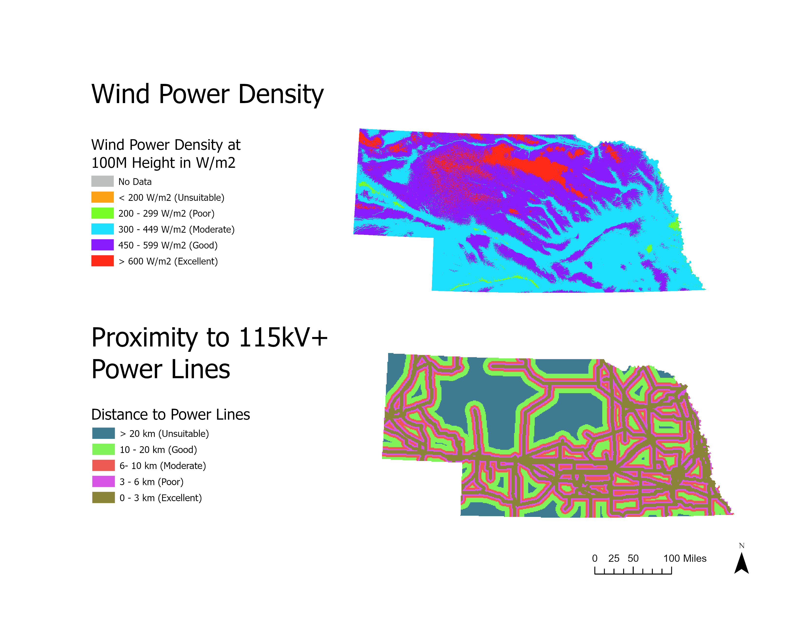
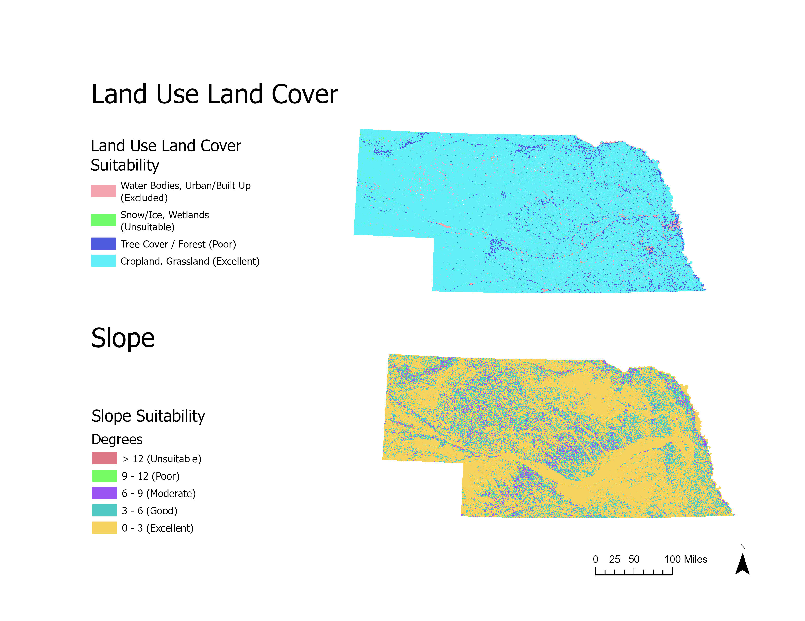
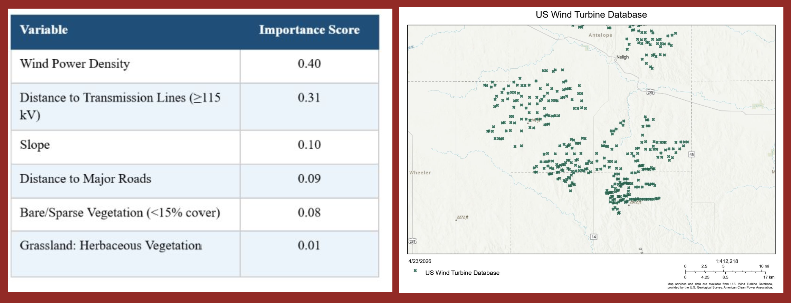
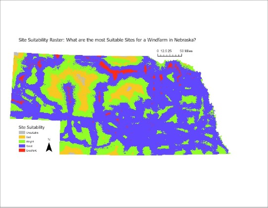
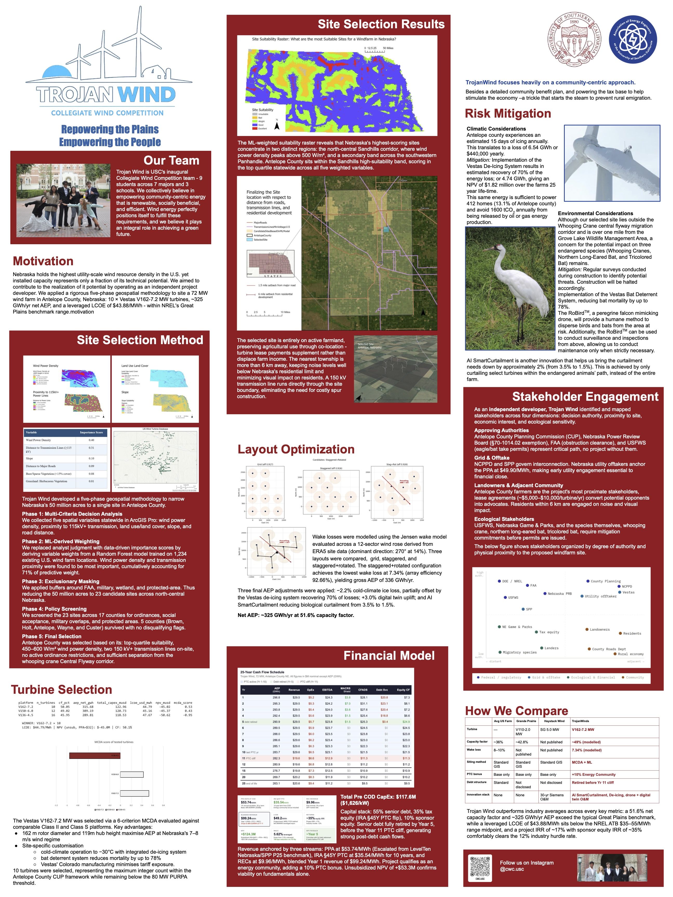

# WindSite AI
### Wind Farm Suitability Analysis Platform

**Live app:** [wind-site-ai.lovable.app](https://wind-site-ai.lovable.app)

---

## What It Does

WindSite AI is a full-stack geospatial ML platform that identifies optimal wind farm development sites across US states. A user selects a state, the platform renders a suitability map generated by a Random Forest model, and Claude AI produces an actionable site acquisition brief for development teams — covering priority counties, project risk factors, and recommended next steps.

Built as a proof-of-concept for automating early-stage wind energy due diligence, the kind of analysis that currently takes consultants days to produce manually.

---

## How It Works

### 1. Data Pipeline
Five geospatial layers are sourced, clipped to the target state boundary, and normalized to a 0–1 scale:

| Layer | Source | Suitability Logic |
|---|---|---|
| Wind Power Density | Global Wind Atlas | Higher density = more suitable |
| Distance to Transmission Lines | HIFLD | Closer = more suitable |
| Distance to Primary/Secondary Roads | TIGER/Line | Closer = more suitable |
| Land Use Land Cover | ESA Sentinel-2 | Open/agricultural land = more suitable |
| Terrain Slope | USGS DEM | Flatter = more suitable |

### 2. Training Data
The Random Forest was trained on 1,234 existing US wind farm locations. Existing wind turbine locations from the US Wind Turbine Database (USWTDB) are used as positive training samples. Random points in non-turbine areas serve as negative samples. Combined into a binary-labeled point dataset.

### 3. Random Forest Model
Each normalized raster layer is sampled at training points and fed into a Random Forest classifier (scikit-learn). Feature importances determine the weight each variable contributes to final suitability scores.

**Feature importance ranking (Nebraska):**
1. Wind Power Density — highest weight
2. Distance to Transmission Lines
3. Terrain Slope
4. Distance to Roads
5. Land Use Land Cover

Wind power density and transmission proximity account for 
71% of cumulative predictive weight in the Random Forest model.

### 4. Suitability Map
Weighted raster addition produces a final composite suitability surface scored 1–5, rendered via Mapbox GL JS with a classified color ramp.

### 5. AI Analysis
On run, the app calls the Anthropic Claude API with a structured prompt containing the state, model variables, and suitability context. Claude returns a development brief covering priority acquisition counties, key risk factors, and immediate next actions — framed for a project development team, not an academic audience.

---

## Tech Stack

| Layer | Technology |
|---|---|
| Geospatial ML Pipeline | Python, arcpy, ArcGIS Pro |
| Raster Hosting | Mapbox Tilesets |
| Frontend | React, TypeScript (Lovable / TanStack Start) |
| Map Rendering | Mapbox GL JS |
| AI Integration | Anthropic Claude API (claude-haiku-4-5) |
| Deployment | Lovable (lovable.app) |

---

## Project Background

This project extends work originally developed for the **DOE Collegiate Wind Competition (2nd place nationally)**, which required a multi-criteria site evaluation of the Nebraska wind market using MISO interconnection queue data and geospatial analysis. WindSite AI takes that methodology and wraps it in a deployable web interface with an AI interpretation layer.
At the competition, Shivi's team won 1st place for Best Poster.

---

## Current State & Roadmap

**Live:** Nebraska suitability analysis fully operational.

**Planned:**
- Open-source pipeline rewrite (rasterio, geopandas) to enable any-state dynamic analysis
- True agentic loop — Claude calls the siting pipeline as a tool, returns structured go/no-go recommendations
- Interconnection queue integration (MISO, PJM, ERCOT) for congestion-aware siting
- Parcel-level land ownership overlay for acquisition targeting

---

## Author

**Shivi Anand** — Spatial Analyst & Energy Siting Researcher  
USC B.S. Global GeoDesign (GIS, Spatial Sciences, Urban Planning) & Applied Analytics — May 2026  
[LinkedIn](https://www.linkedin.com/in/shivi-anand-45b88b1a6/) 
